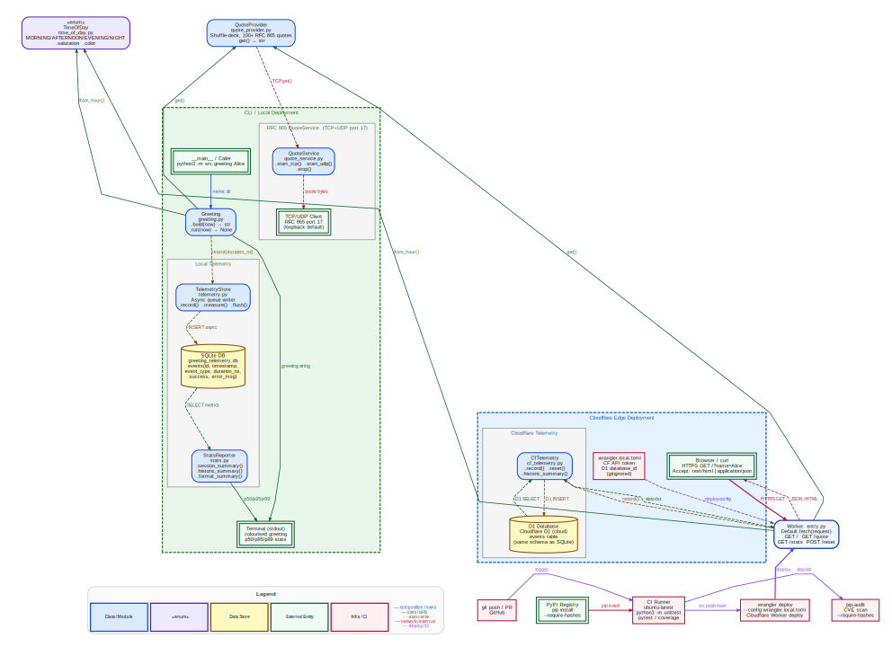
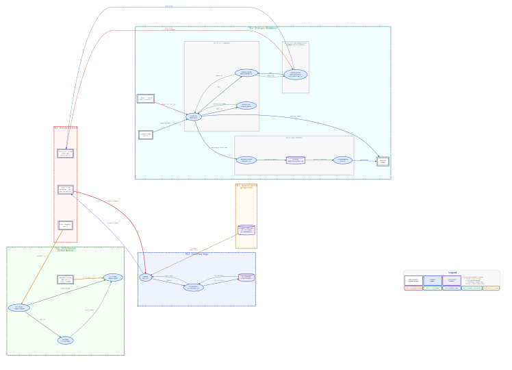

# Greeting

> **Live demo:** [greeting-worker.cancun.workers.dev](https://greeting-worker.cancun.workers.dev/) — a new inspirational quote every minute, colour-coded to your local time of day.

A time-aware, colourised terminal greeting application and Cloudflare Worker HTTP API written in Python. Combines RFC 865 Quote of the Day, async nanosecond-precision telemetry, and a full OWASP threat model.

---

## Architecture

The system has two deployment targets that share a common core:

| Component | CLI / Local | Cloudflare Edge |
|---|---|---|
| Greeting logic | `Greeting` + `TimeOfDay` | `Worker entry.py` + `TimeOfDay` |
| Quote source | `QuoteProvider` → `QuoteService` (RFC 865 TCP/UDP) | `QuoteProvider` (in-isolate) |
| Telemetry | `TelemetryStore` → SQLite | `CfTelemetry` → D1 |
| Stats | `StatsReporter` (p50/p95/p99) | `CfStatsSummary` (JSON API) |
| Dev server | `python3 src/greeting.py` | `worker/src/local_server.py` |

**Architecture diagram** (vector, crisp at any zoom):



**Data flow diagram** with trust boundaries (vector):



---

## Time Periods

| Period | Hours | Terminal colour |
|---|---|---|
| Morning | 06:00 – 11:59 | Yellow |
| Afternoon | 12:00 – 17:59 | Cyan |
| Evening | 18:00 – 20:59 | Magenta |
| Night | 21:00 – 05:59 | Blue |

---

## Requirements

- Python 3.10+
- [`colorama`](https://pypi.org/project/colorama/) 0.4.6

```bash
pip install -r requirements.txt
```

---

## Quick Start

```bash
# Greet with quote + telemetry
make run NAME="Alice"

# Wipe telemetry DB first, then run
make run NAME="Alice" RESET=1

# Print all-time p50/p95/p99 stats
make report
```

Or directly:

```bash
python3 src/greeting.py Alice
# Good morning, Alice!  [09:30 AM]
# The only way to do great work is to love what you do.
# — Steve Jobs
```

---

## Programmatic API

```python
from src.greeting import Greeting
from src.quote_provider import QuoteProvider
from src.telemetry import TelemetryStore

store = TelemetryStore()
store.start()

Greeting("Alice", quote_provider=QuoteProvider(), telemetry=store).run()

store.stop()
```

RFC 865 TCP server in a background thread:

```python
import threading
from src.quote_service import QuoteService

svc = QuoteService(port=1717)          # port > 1023 for unprivileged use
t = threading.Thread(target=svc.start_tcp, daemon=True)
t.start()
# nc 127.0.0.1 1717
```

---

## Worker HTTP API

| Method | Path | Description |
|---|---|---|
| `GET` | `/?name=Alice` | Greeting + quote (JSON or HTML) |
| `GET` | `/quote` | Random RFC 865 quote |
| `GET` | `/stats?event=greeting` | Historic telemetry summary (JSON) |
| `POST` | `/reset` | Wipe all telemetry (204) |

Run locally (no Node, no Wrangler needed):

```bash
make worker-dev                        # http://localhost:8787
make worker-dev PORT=9000              # custom port
```

Deploy to Cloudflare:

```bash
make worker-deploy                     # uses wrangler.local.toml (gitignored)
```

---

## Project Structure

```
src/
  time_of_day.py       TimeOfDay enum — period classification, colours, salutations
  greeting.py          Greeting class — builds and prints the colourised message
  quote_provider.py    QuoteProvider — 100+ RFC 865 quotes, shuffle-deck selection
  quote_service.py     QuoteService  — RFC 865 TCP/UDP server (port 17, configurable)
  telemetry.py         TelemetryStore — async SQLite writer, nanosecond precision
  stats.py             StatsReporter — min/max/mean/p50/p95/p99 from telemetry DB

worker/
  src/entry.py         Cloudflare Worker entry point (HTTP API, WorkerEntrypoint)
  src/local_server.py  Local dev server (stdlib http.server, no Node needed)
  src/cf_telemetry.py  D1-backed async telemetry adapter
  src/time_of_day.py   colorama-free TimeOfDay (CSS hex colours for HTML)
  src/quote_provider.py  Quote corpus (mirrors src/)
  schema.sql           D1 migration schema (mirrors SQLite schema)
  wrangler.toml        Public Wrangler config (placeholder database_id)
  wrangler.local.toml  Real config with CF token + D1 ID (gitignored)

tests/
  test_time_of_day.py    TimeOfDay unit tests
  test_greeting.py       Greeting unit tests
  test_quote_provider.py QuoteProvider unit tests
  test_quote_service.py  QuoteService unit + integration tests (real sockets)
  test_telemetry.py      TelemetryStore + StatsReporter unit tests
  test_security.py       Security regression tests (T-01 – T-22)
  test_integration.py    End-to-end integration tests (no mocks)
  test_benchmark.py      Performance regression tests (timeit thresholds)
  scale_test.py          High-concurrency scale test (configurable duration + workers)

worker/tests/
  test_worker.py         Worker routing, telemetry, HTML, and sanitisation tests

scripts/
  build_arch.py          Generates docs/arch.svg (architecture diagram)
  build_dfd.py           Generates docs/dfd.svg (data flow diagram, trust boundaries)
  build_tc_json.py       Generates docs/threat_model.tc.json (AWS Threat Composer)
  build_threats.py       Threat model build helper
  dev.sh                 POSIX convenience script wrapping all Makefile targets

docs/
  threat_model.md        OWASP STRIDE threat model (v1.5.0, 22 threats)
  threat_model.tc.json   AWS Threat Composer importable JSON
  arch.svg               Architecture diagram (vector SVG)
  dfd.svg                Data flow diagram with trust boundaries (vector SVG)
  dfd.png                Data flow diagram (raster PNG fallback)
```

---

## Key Commands

```bash
# Application
make run NAME="Alice"          # greet with quote + telemetry
make run NAME="Alice" RESET=1  # wipe DB first, then run
make reset                     # wipe telemetry database
make report                    # print all-time p50/p95/p99 stats

# Testing
make test                      # 167 CLI tests (unittest)
make worker-test               # 54 worker tests
make scale-test                # high-concurrency scale test (60s, auto concurrency)
make scale-test DURATION=120 CONCURRENCY=100 TCP=1

# Worker
make worker-dev                # local dev server on :8787
make worker-deploy             # deploy to Cloudflare

# Quality
make audit                     # CVE scan via pip-audit
make docs                      # build Sphinx HTML docs → docs/_build/html/

# Diagrams (regenerate SVGs)
python3 scripts/build_arch.py  # → docs/arch.svg
python3 scripts/build_dfd.py   # → docs/dfd.svg

# Or via the convenience script:
sh scripts/dev.sh help
NAME=Alice sh scripts/dev.sh run
```

---

## Test Coverage

| Suite | Tests | Scope |
|---|---|---|
| CLI unit + integration | 167 | `TimeOfDay`, `Greeting`, `QuoteProvider`, `QuoteService`, `TelemetryStore`, `StatsReporter` |
| Security regression | 22 threats | T-01 – T-22 (ANSI injection, DoS, TCP exhaustion, UDP echo, error leak) |
| Worker | 54 | Routing, sanitisation, telemetry, HTML generation, CfTelemetry no-op mode |
| Scale | configurable | High-concurrency greeting + optional TCP QuoteService load |
| Benchmark | 6 | `TimeOfDay.from_hour()`, `Greeting.build()`, `QuoteProvider.get()` — timeit thresholds |

Run all:

```bash
make test && make worker-test
```

---

## CI/CD

GitHub Actions runs on every push and pull request to `main`:

- Full test suite across Python 3.10, 3.11, 3.12, and 3.13
- CVE scan via `pip-audit --require-hashes`
- Sphinx documentation build + artifact upload
- All third-party actions pinned to full commit SHAs (supply chain hardening, T-04)
- `permissions: contents: read` at workflow and job level (T-08)

---

## Security

The project includes a full [OWASP STRIDE threat model](docs/threat_model.md) (v1.5.0) covering 22 threats across the CLI, RFC 865 network service, Cloudflare Worker, CI/CD pipeline, and dependency supply chain.

Machine-readable format: [`docs/threat_model.tc.json`](docs/threat_model.tc.json) — importable into [AWS Threat Composer](https://awslabs.github.io/threat-composer/).

Key controls already in place:

| Control | Addresses |
|---|---|
| Two-pass ANSI strip + 100-char cap on `name` | T-13 (ANSI injection) |
| `pip-audit` in CI + version-pinned deps | T-01 (supply chain) |
| Actions pinned to full commit SHAs | T-04 (mutable tags) |
| `permissions: contents: read` in CI | T-08 (excessive permissions) |
| `QuoteService` defaults to `127.0.0.1` | T-10 (accidental public exposure) |
| Parameterised D1 queries | SQL injection prevention |
| `error_msg` truncated to 500 chars | T-19 (unbounded DB writes) |
| `wrangler.local.toml` gitignored | T-06 (credential leak) |

See [SECURITY.md](SECURITY.md) for the responsible disclosure policy.

---

## Documentation

Sphinx API docs are built by CI and uploaded as an artifact on every push to `main`.

Build locally:

```bash
pip install -r requirements-docs.txt
make docs
# → docs/_build/html/index.html
```

---

## License

MIT — see [LICENSE](LICENSE).

---

## Acknowledgements

Developed with AI assistance. All source code, tests, documentation, and configuration were generated by [Kiro](https://kiro.dev) based on iterative human-provided requirements. The human contributor defined scope, reviewed every change, guided architectural decisions, and validated the output. See [ACKNOWLEDGEMENTS.md](ACKNOWLEDGEMENTS.md) for full details.
